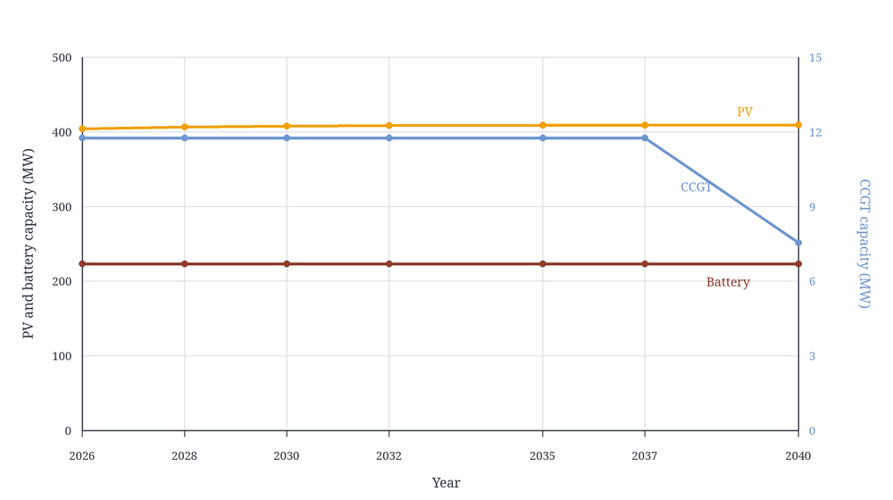

The most common formalism to model capacity expansion is the static formulation, or "single-year formulation". 
When modeling a capacity expansion problem at year 2050 using this formalism, one asks the question: "What would the optimal system be in year 2050?"
Compared to modelling a full pathway, this formalism is very handy because it simplifies the assumptions and reduces the computational burden, at the cost of a simple economic operation: the annualization of the investment costs (transforming single-occurrence costs into equivalent but recurring costs).

To my knowledge, most capacity expansion studies use this formalism. 

However, this simplification comes with hypotheses that are sometimes overlooked. 
As its name indicates, this formalism is static: it does not consider the path leading to the target year. Depending on the system, the path might be costly, or present some vulnerabilities. Also absent is the dynamic aspect of investment and capacity expansion. 

A difficult question is costs referential. Models consume costs data, e.g. overnigh / connection / O&M / fuel / decommissioning / etc., in addition to multiple time-sensitive data such as lead time. When modelling year $y$, should the model incorporate cost data associated with year $y$, or some prior date corresponding to a hypothetical non-modelled year when capacity is actually deployed? And should this hypothetical date be the same for each technology[^1]?

[^1]:In addition to the economic correctness of using specific years for costs data, there also is the question of trust in projections. Some economists prefer using present-day costs even for projections, as projections are generally false. However, this is a different question that will not be discussed further in this post.

In my opinion, moreso than correctness, the biggest drawback of modelling snapshots is that they do not answer the question "What should I do now?", or "What happens if I don't do $something$ now". A normative snapshot of year 2050 does not answer that question about short-term priorities. I might give clues, or a general direction, but it does not prioritize actions. This is detrimental to the usefulness of the modelling effort: the reason many policy reports exist is because decision-makers need / want to know what they could do now. 
Of course, reports can use expert judgement or complementary analysis to try and answer that immediate question, but there often is a long jump to the conclusions.

The "pathway" formalism explicitly models the steps coming before the target year.

Multiple hypotheses e.g. end year. More complex to implement, in particular to manage a semi-static aspect of some phenomena + difficult edges e.g. exact end of lifetime not matching modeled snapshots.
But has the advantage of explicitly modelling the chronology, therefore more suited to answer "what now".

+ annualization
+ which costs to use
+ implicit hypotheses
+ existing assets: 

Ideas

  * most of the cost is the near-future trajectory, because of discounting.
  * if the endyear is distant enough, the end state will equal the annualized snapshot
  * snapshot tells what the end state is, pathway tells where to invest now
  * reasons for considering pathway: existing capacity, defining short-term priorities
  * Pros and cons
  * Cons: implicit hypotheses
  * make a table to compare the formalisms
  * residual value (modification of value because of lifetime > end)

{fig-align="center" width="100%"}

| case | year | PV MW | battery MW | CCGT MW | CCGT CCS MW |
|---|---:|---:|---:|---:|---:|
| annualized snapshot | 2040 | 456.808 | 247.283 | 3.563 | 0.000 |
| pathway 2050 | 2026 | 404.494 | 223.417 | 11.759 | 0.000 |
| pathway 2050 | 2028 | 406.837 | 223.417 | 11.759 | 0.000 |
| pathway 2050 | 2030 | 407.939 | 223.417 | 11.759 | 0.000 |
| pathway 2050 | 2032 | 408.835 | 223.417 | 11.759 | 0.000 |
| pathway 2050 | 2035 | 409.149 | 223.417 | 11.759 | 0.000 |
| pathway 2050 | 2037 | 409.149 | 223.417 | 11.759 | 0.000 |
| pathway 2050 | 2040 | 409.311 | 223.417 | 7.551 | 0.000 |
