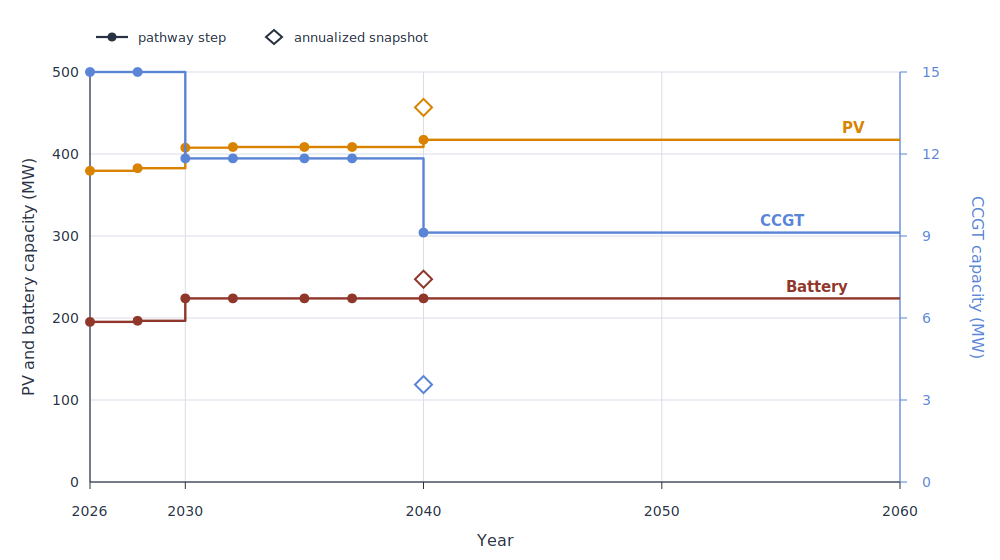

The most common formalism to model capacity expansion is the static formulation, or "single-year formulation". 
When modelling a capacity expansion problem at year 2050 using this formalism, one asks the question: "What would the optimal system be in year 2050?"
Compared to modelling a full pathway, this formalism is very handy because it simplifies the assumptions and reduces the computational burden, at the cost of a simple economic operation: the annualization of the investment costs (transforming single-occurrence costs into equivalent but recurring costs).

To my knowledge, most capacity expansion studies use this formalism. 
However, this simplification comes with assumptions that are sometimes overlooked. 
As its name indicates, this formalism is static: it does not consider the path leading to the target year. Depending on the system, the path might be costly, or present some vulnerabilities. Also absent is the dynamic aspect of investment and capacity expansion. 

A difficult question is cost reference year. Models consume cost data, e.g. overnight / connection / O&M / fuel / decommissioning / etc., in addition to multiple time-sensitive data such as lead time. When modelling year $y$, should the model incorporate cost data associated with year $y$, or some prior date corresponding to a hypothetical non-modelled year when capacity is actually deployed? And should this hypothetical date be the same for each technology[^1]?

[^1]:In addition to the economic correctness of using specific years for cost data, there also is the question of trust in projections. Some economists prefer using present-day costs even for projections, as projections are generally false. However, this is a different question that will not be discussed further in this post.

In my opinion, more so than correctness, one of the biggest drawbacks of modelling snapshots is that they do not answer the question "What should I do now?", or "What happens if I don't do X now". A normative snapshot of year 2050 does not answer that question about short-term priorities. It might give clues, or a general direction, but it does not prioritize actions. This is detrimental to the usefulness of the modelling effort: the reason many policy reports exist is because decision-makers need / want to know what they could do now. 
This drawback is reinforced by discounting: investment decisions in the far future have lower present value weight. In other words, their relative importance is lower than the near-term investments.
Of course, reports can use expert judgement or complementary analysis to try and answer the question of near-term investments, but there often is a long jump to the conclusions and generally isn't a model-backed analysis.

The "pathway" formalism explicitly models the steps coming before the target year. In general, the assumption is perfect foresight across years: the decisions taken at year $y - \Delta y$ are made with year $y$ in sight[^2]. This is the formulation used by [EnergyPathway.jl](https://github.com/GKrivtchik/EnergyPathway.jl), a pathway model built on top of the composable energy system modelling toolkit [Nosy.jl](https://github.com/oecd-nea/Nosy.jl). 

[^2]: Some pathway models are myopic, meaning that decisions are made year after year. This different formulation is not discussed in this post.

Modelling a scenario under the pathway formalism starts with the definition of the decision years. Assuming you wish to model the transition between 2026 and 2040, one first attempt might be to explicitly model every year in-between, 15 years implying 15 snapshots in total. As the number of nonzeros in the optimization matrix scales linearly with the number of snapshot-years, the size of the pathway's problem might quickly become too large. 

An interesting concept is the decision-year. It is generally possible to define a subset of the pathway years, and only model the snapshots in this subset. If a year is modeled as a snapshot, it allows investment decision; otherwise the year has no investment decision, and its capacity mix and other metrics interpolate the previous decision year. Using this concept, it is generally feasible to reduce the size of the problem. Also, using a higher density of decision-years in the near-term future and reducing the density in the more distant future allows focusing on the short-term decisions.

Nevertheless, the introduction of decision-years is not a trivial concept. For instance, there might not be a decision-year matching the exact end of a component's lifetime. In this case, tricks must be used to make the impact as low as possible. In Pathway.jl, such tricks rely on evaluating residual economic value relative to the mismatch between closest snapshot and expected end of life. That is to say: pathway modelling is not exempt of assumptions either. 

Let's illustrate both snapshot and pathway formalism on the reduction of CO2 emissions of a chlor-alkali facility. The full example is available in [Pathway.jl's examples](TODO). We assume a constant electricity consumption from the facility, associated with progressively more stringent CO2 emissions target. Target year is 2040. The snapshot only models year 2040, the pathway models a subset of years.  Available technologies are: PV, battery storage, CCGT. For simplification purposes, the costs are considered as constant between 2026 and 2040. The optimization objective of the snapshot formulation is the annualized cost; the objective of the pathway approach is the opposite of the net present value (NPV) evaluated until 2060, the economic end of the project.

The capacity expansion is shown in the graph below. After 2040, the pathway capacities are carried forward to 2060 to show the interpolation interval. The x axis extends until 2060 because it is the pathway model's economic horizon. However, the last decision year is 2040, so no new technology is deployed after 2040.

{fig-align="center" width="100%"}

The capacities of all 3 technologies are slightly different between the snapshot and the final pathway's decision year. The pathway optimizes the cost by deploying more CCGT when CO2 emission constraint is looser, then retires some but not all the excess capacity relatively to the snapshot formalism. The last decision year of the pathway in itself is likely more costly than the snapshot, but it makes sense in a dynamic approach. 

It is not surprising that the end state of the pathway is not equal to the snapshot. The reason is that the deployment of capacity has to be optimal for the whole pathway, not specifically for the end state. In particular, the weight of the end-state is not necessarily dominant because of discounting. The economic end of the project (here 2060) can be used to tune the weight of the future against the present in the objective. In particular, an infinite economic project end date theoretically leads to the same result as the snapshot optimization, as the relative weight of the last decision-year shadows the pathway leading to it.