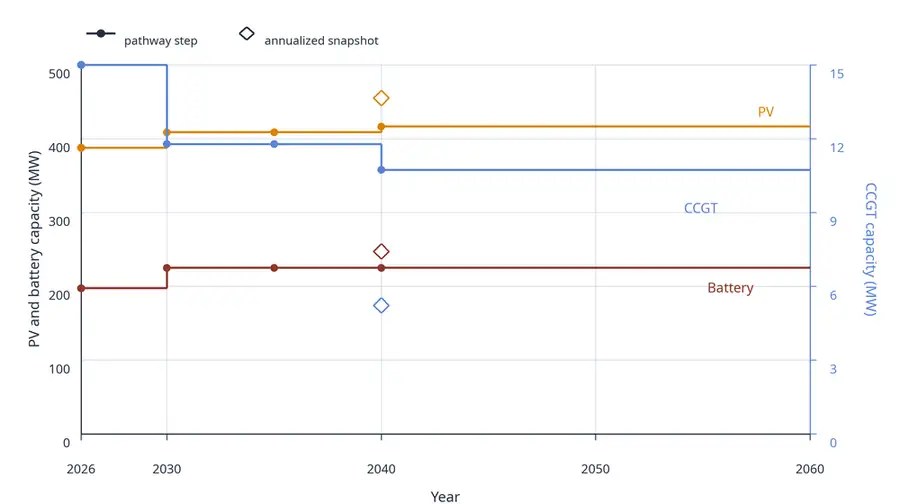

The most common formalism for modelling capacity expansion is the static, or single-year, formulation. 
When modelling a capacity expansion problem for the year 2050 using this formalism, the question is: "What would the optimal system look like in 2050?"
Compared to modelling a full pathway, this formalism is convenient because it simplifies the assumptions and reduces the computational burden, at the cost of a simple economic operation: the annualization of the investment costs (transforming one-time costs into equivalent recurring costs).

To my knowledge, most capacity expansion studies use this formalism. 
However, this simplification comes with assumptions that are sometimes overlooked. 
As the name indicates, this formalism is static: it does not consider the path leading to the target year. Depending on the system, the path might be costly, or create vulnerabilities. The formulation also omits the dynamic aspect of investment and capacity expansion. 

One difficult question is the choice of cost reference year. Models consume cost data such as overnight / connection / O&M / fuel / decommissioning / etc., in addition to time-related inputs such as lead time. When modelling year $y$, should the model incorporate cost data associated with year $y$, or a prior date corresponding to the non-modelled year when capacity is actually deployed? And should this hypothetical date be the same for each technology[^1]?

[^1]: In addition to the economic correctness of using specific years for cost data, there is also the question of trust in projections. Some economists prefer using present-day costs even for projections, as projections are generally, if not always, wrong. However, this is a different question that will not be discussed further in this post.

In my opinion, more so than correctness, one of the biggest drawbacks of modelling snapshots is that they do not answer the question "What should I do now?", or "What happens if I don't do X now". A normative snapshot of year 2050 does not answer that question about short-term priorities. It might give clues, or a general direction, but it does not prioritize actions. This is detrimental to the usefulness of the modelling effort: the reason many policy reports exist is because decision-makers need / want to know what they could do now. 
This drawback is reinforced by discounting: investment decisions in the near term have higher present-value weight. In other words, their relative importance is higher than that of distant-future investments. However, they are indistinguishable in a snapshot model.
Of course, reports can use expert judgement or complementary analysis to try and answer the question of near-term investments, but there is often a large leap between the model outputs and the conclusions, and the near-term recommendations are usually not backed directly by a modelling effort.

The "pathway" formalism explicitly models the steps leading up to the target year. In general, the assumption is perfect foresight across years: the decisions taken at year $y - \Delta y$ are made with year $y$ in sight[^2]. This is the formulation used by [EnergyPathway.jl](https://github.com/GKrivtchik/EnergyPathway.jl), a pathway model built on top of the composable energy system modelling toolkit [Nosy.jl](https://github.com/oecd-nea/Nosy.jl). 

[^2]: Some pathway models are myopic, meaning that decisions are made year after year. This alternative formulation is not discussed in this post.

Modelling a scenario under the pathway formalism starts with the definition of the decision years. Assuming you wish to model the transition between 2026 and 2040, a first attempt might be to explicitly model every year in between, which would mean 15 snapshots in total. As the number of nonzeros in the optimization matrix scales roughly linearly[^3] with the number of snapshot-years, the size of the pathway problem might quickly become too large. 

[^3]: Slightly worse than that, due to temporal coupling and decision year machinery. These additional constraints are not many, but they are difficult linking constraints.

An interesting concept is the decision year. It is generally possible to define a subset of the pathway years, and only model the snapshots in this subset. If a year is modelled as a snapshot, investment decisions can be made in that year; otherwise the year has no investment decision, and its capacity mix and other metrics are carried forward from the previous decision year: EnergyPathway.jl treats capacities and other parameters as piecewise constant between decision years. Using this concept, it is generally feasible to reduce the size of the problem. Also, using a higher density of decision years in the near-term future and reducing the density in the more distant future helps focus the model on short-term decisions.

Nevertheless, the introduction of decision years is not trivial. For instance, there might not be a decision year matching the exact end of a component's lifetime. In this case, tricks must be used to minimize the impact. In EnergyPathway.jl, such tricks rely on evaluating residual economic value relative to the mismatch between the closest snapshot and the expected end of life. That is to say: pathway modelling is not exempt from assumptions either. 

As mentioned above, the general assumption for pathway models is perfect foresight across years. This is a strong hypothesis. As with Snapshot models, sensitivity studies should be run in order to understand the most important parameters and their impact. Modelling to Generate Alternatives (MGA) and [near-optimality analysis](../near_optimality/) are also very useful for pathways. Pathways also interact with multi-stage stochastic programming in an intuitive manner: decision years can also be used to model years in which new information becomes available, even though the complexity of the optimization model grows quickly with the number of decision years.

Let's illustrate both snapshot and pathway formalisms on the reduction of CO2 emissions of a facility that consumes electricity. The full example, including hypotheses and results, is available in [EnergyPathway.jl's examples](https://gkrivtchik.com/EnergyPathway.jl/dev/examples/facility-transition/). We assume a constant electricity consumption from the facility, associated with progressively more stringent CO2 emissions targets. The target year is 2040. The snapshot only models year 2040, the pathway models a subset of years: [2026, 2030, 2035, 2040]. Available technologies are: PV, battery storage, CCGT. For simplicity, the costs are assumed to be constant between 2026 and 2040. The optimization objective of the snapshot formulation is the annualized cost; the objective of the pathway approach is the discounted system cost from 2026 to 2060, 2060 being the economic end of the project.

The capacity expansion is shown in the graph below. After 2040, the pathway capacities are carried forward to 2060 to show the interpolation interval. The x-axis extends until 2060 because it is the pathway model's economic horizon. However, the last decision year is 2040, so no additional capacity is deployed after 2040.

{fig-align="center" width="100%"}

The capacities of all three technologies are different between the snapshot and the final pathway decision year. The PV and battery capacity are quite similar between both, but the CCGT capacity is larger in the end-state of the pathway than in the snapshot. The pathway minimizes the cost by deploying more CCGT when CO2 emissions constraint is looser, then retires some but not all of that additional capacity relative to the snapshot solution. The pathway's last decision year, in isolation, is more costly than the snapshot, but is cost-effective under the dynamic approach. 

It is not surprising that the end state of the pathway does not match the snapshot. The reason is that the capacity deployment has to be optimal for the whole pathway, not just for the end state. In particular, the weight of the end-state is not necessarily dominant because of discounting. The economic end date of the project (here 2060) can be used to tune the weight of the future against the present in the objective. In particular, extending the economic project end date gives more weight to the carried-forward final system, and would generally be expected to move the pathway result closer[^4] to the snapshot optimization, assuming the same assumptions are used to model the lifetime of components.

[^4]: With a discount rate $r > 0$, a cost repeated forever does not receive an infinite weight in present value. If a unit cost is repeated every period starting in the reference year, the discounted sum is a geometric series:
    $1 + \frac{1}{1+r} + \frac{1}{(1+r)^2} + \cdots = \frac{1+r}{r}.$
In other words, carrying the final system forward to an infinite horizon gives it a finite weight - preventing the actual convergence.

All in all, pathway modelling is a powerful tool to analyze the effects of a transition, including the management of existing capacity, the timing for deployment of new technologies based on cost and demand, and time-dependent policies. In particular, it is very helpful to identify the decisions that should be made in the near term. However, even more than snapshots, pathways are very data-intensive. The amount of assumptions and data required to build a pathway is very high. But this is not necessarily a disadvantage relative to snapshots: it is rather that the snapshot formalism, and the interpretation of snapshots, imply many implicit hypotheses that rarely are validated, whereas pathways force the modeller to explicitly formulate such hypotheses.